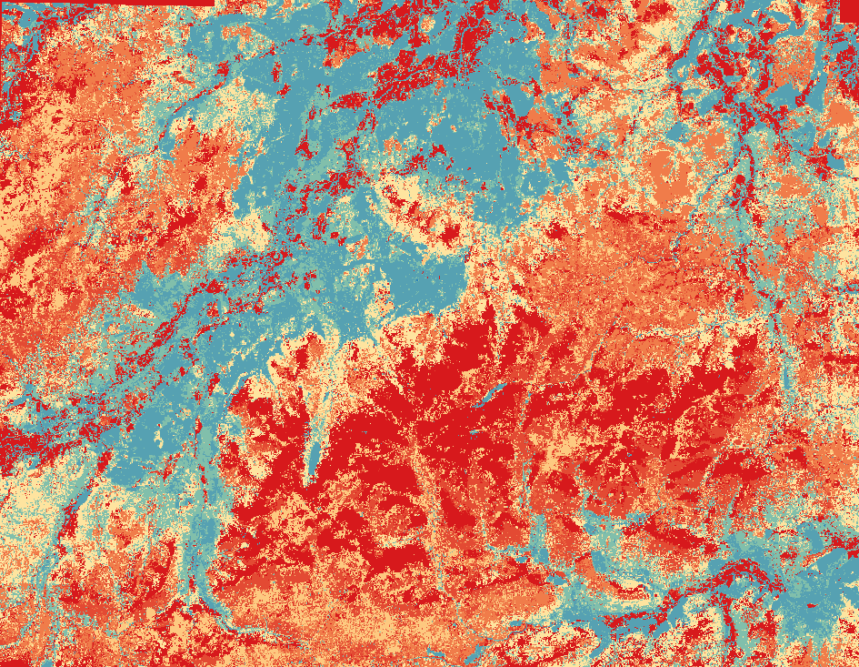
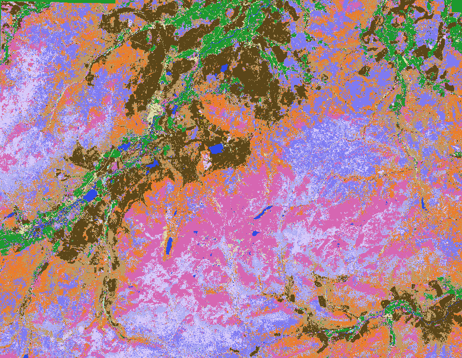

Started the week with the long awaited workshop. It was great to be able to see not only the initial mapping of the Cairngorms but also what could be done in just a few hours in all regions of the world with expert labelling. It was very interesting learning more about the strengths and weaknesses of TESSERA, and how to best select labels, based on what it was capable of mapping in many places.

Looking at the initial Cairngorms map, it became clear that because only plot data had been used, the model didn’t have any labels for some key categories like “urban” or “water”, instead trying to fit these into a type of forest or bog:
A section of the original map:

In order to fix this, I loaded the file into QGIS and manually added some extra labels of where, on satellite imagery and openstreetview I could see some of these missing areas. This improved the map greatly with only the addition of 20 or so labels each for 3 new habitat types.

Next I wanted to improve the categorisation of roads as the model currently believed they were all rivers. After the workshop the previous day, I knew that classifying roads could be difficult due to the 20m resolution of the model, vs the higher resolution of the satellite imagery I was using to plot data. To ensure that I was not selecting points beyond the resolution of the model, I used points where the model falsely predicted a road as a river and then tried to refine it with more hidden areas.

A section of the improved map:

After a discussion, we decided to change the classes that we were using for the model, as the originals were based off of field data for a different project and some classes like “heath_restored” and “heath_degraded” would be difficult for the model to tell apart as the restoration of the heaths had only just started so changes between them would be minimal. This resulted in some categories being merged, and others created.

I reorganised our habitat classification system into the following categories: Bog natural, Bog degraded, Bog restored, Heath, Pine (Old Growth), Pine (Plantations or Mature), Alpine, and Broadleaved forests, Water, Built up areas, Semi-natural grasslands, Improved grasslands and pastures, and Open scree slopes.

Hopefully sometime next week once I regain access to the embeddings and a new server to run the model on, I will be able to regenerate a new map and see the progress that has been made.

This week I also helped Nina with her project of mapping New Zealand, as the actual process is decently similar to that of the Cairngorms. For this, I downloaded LRIS data of New Zealand into QGIS and generated random points within each layer to provide more labels for that map. The size of these files resulted in my laptop crashing a few times (turns out New Zealand is quite a bit larger than the Cairngorms which I am used to dealing with), but after splitting New Zealand into 3 it became a lot more manageable. After getting all of these points, it was just a matter of assigning a class to each one and then combining all the files together into the correct format for RF to be run on them in the future.
